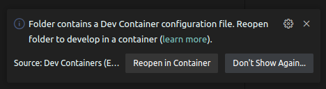
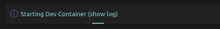

# Developing workerd with Visual Studio Code

Visual Studio Code is a commonly used editor by workerd developers (other editors are great too!). These notes present some getting started tips. If you have tricks and tips that would improve the developer experience, please let us know!

## Using the [dev container](https://containers.dev/)

workerd includes a [devcontainer](https://containers.dev/) setup that automates a majority of the developer environment setup by shifting the development to a container based setup. To make use of this, install the [devcontainer extension](https://marketplace.visualstudio.com/items?itemName=ms-vscode-remote.remote-containers). You can then either (a) use the **Dev Containers: Open Folder In Container** command and navigate to the checked out location or (b) open the project normally, in which case vscode should detect the presence of the devcontainer. Clicking **Reopen in Container** on the modal below will relaunch your workspaces in a container.



_Note_: It may take some time to initially bootstrap the dev container. To monitor its progress, click **show log** modal on the new window. Subsequent launches will be cached.



## Recommended extensions for developing workerd

The recommended extensions to install are:

* [LLVM clangd extension](https://marketplace.visualstudio.com/items?itemName=llvm-vs-code-extensions.vscode-clangd) for code completion and navigation.

  This is described below in [Clangd code completion, navigation, language server](#clangd-code-completion-navigation-language-server).

* [Microsoft C/C++ extension](https://marketplace.visualstudio.com/items?itemName=ms-vscode.cpptools) for debugging, syntax highlighting, etc.

  The Microsoft C/C++ extension has IntelliSense support that is not compatible with the clangd extension. We recommend disabling the Microsoft IntelliSense Engine for this project ("Settings → C_Cpp.intelliSenseEngine → disabled").

* [Capnproto-syntax extension](https://marketplace.visualstudio.com/items?itemName=abronan.capnproto-syntax) for syntax highlighting if you are editing `.capnp` files.

* [GitLens extension](https://marketplace.visualstudio.com/items?itemName=eamodio.gitlens) for super charged git functionality within Visual Studio Code.

* [markdownlint](https://marketplace.visualstudio.com/items?itemName=DavidAnson.vscode-markdownlint) for creating well formed markdown documents.

You can install all of these extensions with the **Extensions: Configure Recommended Extensions (Workspace Folder)** command. You can find this through the Visual Studio Code Command Palette (`shift+ctrl+p` on Linux / Windows, `shift+cmd+p` on OS X) and typing "Configure Recommended Extensions". The recommendations that will be installed can be found in the [.vscode/extensions.json](../.vscode/extensions.json) file.

## VSCode Tasks for workerd

The [.vscode/tasks.json](../.vscode/tasks.json) file provides a few useful tasks for use within VSCode:

* Bazel build workerd (dbg)
* Bazel build workerd (fastbuild)
* Bazel build workerd (opt)
* Bazel build all (dbg)
* Bazel clean
* Bazel clean --expunge
* Bazel run all tests (dbg)
* Bazel run all tests (fastbuild)
* Bazel run all tests (opt)
* Generate rust-project.json

The keyboard shortcut for **Tasks: Run Build Task** is `shift+ctrl+b` on Linux and Windows, `shift+cmd+b` on OS X.

The test tasks can be run with **Tasks: Run Test Task**, which does not have a default
keybinding in VSCode, but can be found with the command palette with `shift+ctrl+p` on Linux and Windows, and `shift+cmd+p` on OS X.

## Running and debugging workerd in Visual Studio Code

There are workerd debugging targets within Visual Studio Code which are supported on Linux, OS X, and Windows.

The [.vscode/launch.json](../.vscode/launch.json) file has launch targets to that can be debugged within VSCode.

Before you start debugging, ensure that you have saved a vscode workspace for workerd,
"File → Save Workspace As...". For more information about workspaces, see <https://code.visualstudio.com/docs/editor/workspaces>.

The **Run and Debug** view in VSCode (accessible via `shift+ctrl+d` on Linux and Windows, `shift+cmd+d` on OS X) has a drop-down that allows you to choose which target to run and debug. After selecting a target, hitting `F5` will launch the
target with the debugger attached.

The main targets of interest are:

* workerd (dbg)
* workerd with inspector enabled (dbg)
* workerd test case (dbg)
* workerd wd-test case (dbg)

Launching either "workerd (dbg)" or "workerd with inspector enabled (dbg)" will prompt for a workerd configuration for
workerd to serve, the default is [${workspaceFolder}/samples/helloworld/config.capnp](../samples/helloworld/config.capnp).

Launching "workerd test case (dbg)" will prompt for a test binary to debug, the default is `bazel-bin/src/workerd/jsg/jsg-test`.

Launching "workerd wd-test case (dbg)" will prompt for wd-test file to provide to workerd to debug, the default is `src/workerd/api/node/path-test.wd-test`.

## Clangd code completion, navigation, language server

We use clangd for code completion and navigation within the Visual Code. We use the simple
[compile_flags.txt](../compile_flags.txt) option provide compiler arguments for clangd to analyze sources.

If `compile_flags.txt` is not working well on your system, try running:

```sh
bazel build --copt="-MD" --cxxopt="-MD" //src/workerd/server:workerd
```

to generate dependency files and:

```sh
find bazel-out/ -name '*.d'`
```

to locate the generated dependency files. These files will help you align the include paths in
`compile_flags.txt` with the ones that the bazel build is using.

There is also a script [clangd-check.sh](../tools/unix/clangd-check.sh) that checks every `.h` and
`.c++` file in the workerd source tree. Fixing errors there inevitably improves the experience in
Visual Studio Code.

In the past we used [Hedron's Bazel Compile Commands Extractor](https://github.com/hedronvision/bazel-compile-commands-extractor)
to generate a `compile_commands.json` file for clangd, but this was slow and unreliable for the `workerd` use case
(see <https://github.com/cloudflare/workerd/issues/506>).

## Miscellaneous tips

* There is a handy guide to Visual Studio Code keyboard shortcuts at [aka.ms/vscodekeybindings](https://aka.ms/vscodekeybindings).
* The Command Palette is a great way to find things (`shift+ctrl+p` on Linux / Windows, `shift+cmd+p` on OS X).
* The Keyboard Shortcuts window is also a great resource (`ctrl+k ctrl+s` on Linux / Windows, `cmd+k cmd+s` on OS X).
* Read [Visual Studio Code Tips and Tricks](https://code.visualstudio.com/docs/getstarted/tips-and-tricks).
* Check out the [25 VS Code Productivity Tips and Speed Hacks](https://youtu.be/ifTF3ags0XI) video by Fireship.
