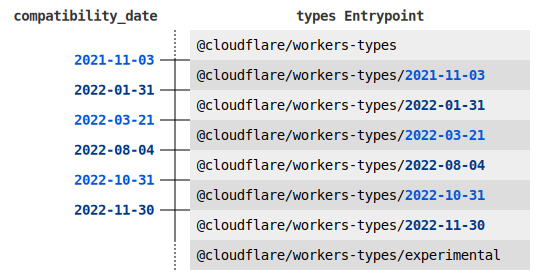

# Cloudflare Workers Types

> :warning: If you're upgrading from version 2, make sure to remove `webworker` from the `lib` array in your
> `tsconfig.json`. These types are now included in `@cloudflare/workers-types`.

## Install

```bash
npm install -D @cloudflare/workers-types
-- Or
yarn add -D @cloudflare/workers-types
```

## Usage

The following is a minimal `tsconfig.json` for use alongside this package:

**`tsconfig.json`**

```json
{
  "compilerOptions": {
    "target": "esnext",
    "module": "esnext",
    "lib": ["esnext"],
    "types": ["@cloudflare/workers-types"]
  }
}
```

### Compatibility dates



The Cloudflare Workers runtime manages backwards compatibility through the use of [Compatibility Dates](https://developers.cloudflare.com/workers/platform/compatibility-dates/). Using different compatibility dates affects the runtime types available to your Worker, and so it's important you specify the correct entrypoint to the `workers-types` package to match your compatibility date (which is usually set in your `wrangler.toml` configuration file). `workers-types` currently exposes the following entrypoints to choose from:

- `@cloudflare/workers-types`

  The default entrypoint exposes the runtime types for a compatibility date before `2021-11-03`.

- `@cloudflare/workers-types/2021-11-03`

  This entrypoint exposes the runtime types for a compatibility date between `2021-11-03` and `2022-01-31`.

- `@cloudflare/workers-types/2022-01-31`

  This entrypoint exposes the runtime types for a compatibility date between `2022-01-31` and `2022-03-21`.

- `@cloudflare/workers-types/2022-03-21`

  This entrypoint exposes the runtime types for a compatibility date between `2022-03-21` and `2022-08-04`.

- `@cloudflare/workers-types/2022-08-04`

  This entrypoint exposes the runtime types for a compatibility date between `2022-08-04` and `2022-10-31`.

- `@cloudflare/workers-types/2022-10-31`

  This entrypoint exposes the runtime types for a compatibility date between `2022-10-31` and `2022-11-30`.

- `@cloudflare/workers-types/2022-11-30`

  This entrypoint exposes the runtime types for a compatibility date between `2022-11-30` and `2023-03-01`.

- `@cloudflare/workers-types/2023-03-01`

  This entrypoint exposes the runtime types for a compatibility date between `2023-03-01` and `2023-07-01`.

- `@cloudflare/workers-types/2023-07-01`

  This entrypoint exposes the runtime types for a compatibility date after `2023-07-01`.

- `@cloudflare/workers-types/experimental`

  This entrypoint exposes the runtime types for the latest compatibility date. The types exposed by this entrypoint will change over time to always reflect the latest version of the Workers runtime.

To use one of these entrypoints, you need to specify them in your `tsconfig.json`. For example, this is a sample `tsconfig.json` for using the `2022-08-04` entrypoint.

```json
{
  "compilerOptions": {
    "target": "esnext",
    "module": "esnext",
    "lib": ["esnext"],
    "types": ["@cloudflare/workers-types/2022-08-04"]
  }
}
```

### Importable Types

It's not always possible (or desirable) to modify the `tsconfig.json` settings for a project to include all the Cloudflare Workers types. For use cases like that, this package provides importable versions of its types, which are usable with no additional `tsconfig.json` setup. For example:

```ts
import type { Request as WorkerRequest, ExecutionContext } from "@cloudflare/workers-types/experimental"

export default {
  fetch(request: WorkerRequest, env: unknown, ctx: ExecutionContext) {
    return new Response("OK")
  }
}
```


### Using bindings

It's recommended that you create a type file for any bindings your Worker uses. Create a file named
`worker-configuration.d.ts` in your src directory.

If you're using Module Workers, it should look like this:
```typescript
// worker-configuration.d.ts
interface Env {
  MY_ENV_VAR: string;
  MY_SECRET: string;
  myKVNamespace: KVNamespace;
}
```
For Service Workers, it should augment the global scope:
```typescript
// worker-configuration.d.ts
declare global {
  const MY_ENV_VAR: string;
  const MY_SECRET: string;
  const myKVNamespace: KVNamespace;
}
export {}
```

Wrangler can also generate this for you automatically from your `wrangler.toml` configuration file, using the `wrangler types` command.

